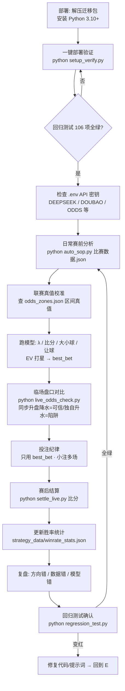
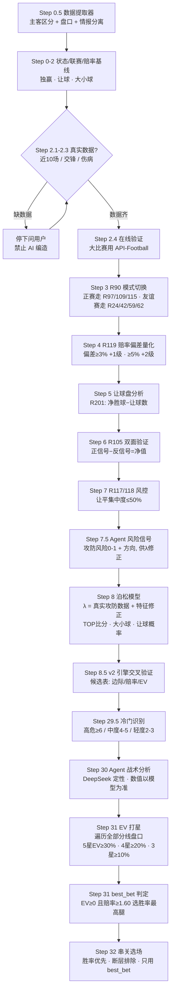
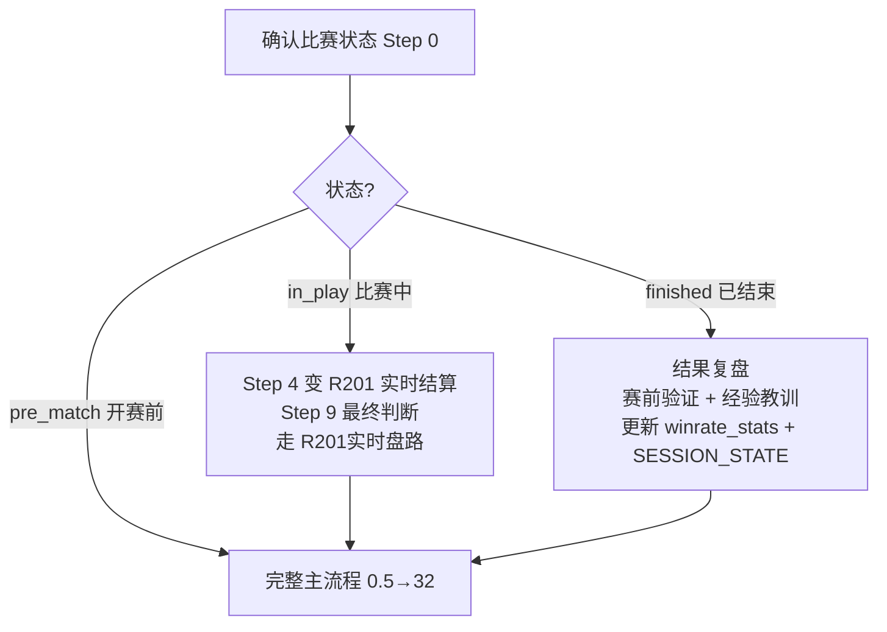

# 足球预测系统 — 流程文档与流程图

> 本文件把「使用流程.md」的日常闭环与「SOP_30STEP.md」的 30 步分析链路整理成文档 + 流程图。
> 铁律：数据不编造（用户提供/API 验证）、数值必须模型计算、串关只用 best_bet、改完必跑回归测试。

---

## 一、系统使用流程（对应 使用流程.md）

### 1.1 文字版流程

1. **部署与首次启动**：解压迁移包 → 安装 Python 3.10+ → 双击 `一键部署.bat`（或 `python setup_verify.py`）→ 检查 `.env` API 密钥 → 可选验证盘口 API（`fetch_live_odds.py --test`）
2. **日常赛前分析**：收集真实数据（盘口+情报）→ 联赛真值校准（查 `strategy_data/*_odds_zones.json`）→ 跑模型（`auto_sop.py` 或 AI 按 30 步 SOP）→ 临场盘口对比（`live_odds_check.py`）→ 落盘存档
3. **盘口抓取**：`fetch_live_odds.py --test` 验证 key → `--league 联赛` 单抓 → 全量抓 9 联赛
4. **投注纪律**：只用 best_bet / 单场 ≤5% 本金 / 串关 ≤2% / 方向集中 / 高赔慎追 / 互斥不串
5. **赛后结算**：`settle_live.py "主队 vs 客队 1-1"` → 更新 `winrate_stats.json` → 复盘（方向错/数据错/模型错）
6. **质检防退化**：改任何代码/提示词/SOP 后必须 `python regression_test.py` 全绿；新数据格式先查 `DATA_FORMATS.md`，清单外停下确认

### 1.2 使用流程图

---

## 二、30 步 SOP 分析流程（对应 SOP_30STEP.md）

### 2.1 阶段总览

| 阶段 | 步骤 | 内容 | 执行方 |
|---|---|---|---|
| 一 数据准备 | 0.5–6 | 数据提取器 / 状态确认 / 赔率基线 / 近10场 / 交锋 / 伤病 / 阵型 / 在线验证 | 提取器 + 用户真实数据 |
| 二 模式与赔率 | 3–4 | R90 模式切换 / R119 赔率偏差量化 | 规则引擎 |
| 三 让球与验证 | 5–7.5 | 让球盘分析 / R105 双面验证 / 风控 / Agent 风险信号 | 规则引擎 + Agent |
| 四 模型计算 | 8 | 泊松 λ + 特征修正 + Agent 信号修正 → 比分/大小球/让球概率 | 代码/模型 |
| 五 冷门与战术 | 8.5, 29.5–30 | v2 引擎交叉验证 / 冷门识别 / Agent 战术分析 | v2 + 冷门引擎 + DeepSeek |
| 六 EV 打星 | 31 | 全盘口遍历 EV = 概率×赔率−1 → best_bet | 模型计算 |
| 七 串关选场 | 32 | 胜率优先 / 断层排除 / 防爆冷 | 模型计算 |

### 2.2 主流程（开赛前 pre_match）

### 2.3 状态分支（比赛中 / 已结束）

---

## 三、关键铁律速查

- **数据铁律**：Step 3-5（近10场/交锋/伤病）必须用户真实数据，AI 生成一律视为编造
- **计算铁律**：所有数值必须代码/模型产出（泊松/ML/规则引擎/去水），禁止 LLM 估算
- **流程铁律**：严格按 Step 0.5→32 顺序，一步不跳；数据缺失/无法计算 → 停下来问用户
- **best_bet 铁律**：EV≥0 且赔率≥1.60 前提下选胜率最高腿；串关必须用它，禁止手动改选（湖北事件教训）
- **防退化铁律**：改任何代码/提示词/SOP 后必须 `python regression_test.py` 全绿（106 项）
- **新格式铁律**：遇到 DATA_FORMATS.md 清单外的数据格式 → 停下确认 → 加解析 → 写回归断言 → 更新清单